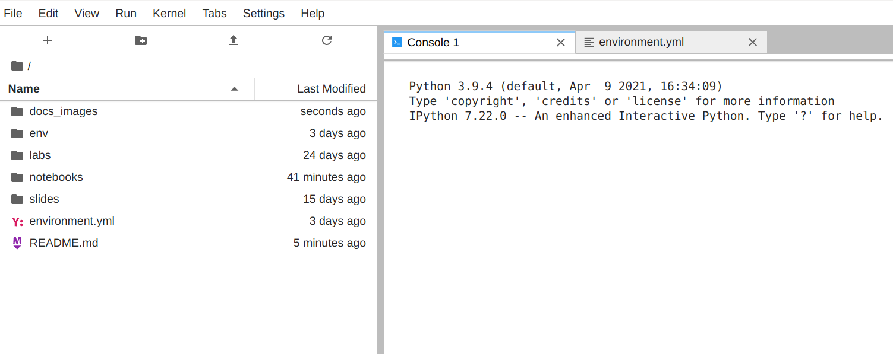
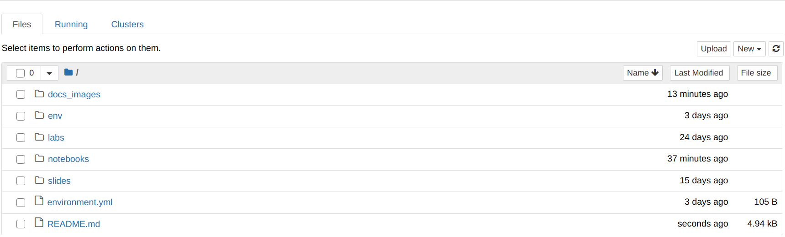

# Data Science, Machine Learning, and its Applications

## Updating Notebooks

This documentation describe two different ways to start working remotely.

### Running in the cloud through Google Colab + GitHub

This method doesn't require any other package or program installed in your
computer than just you're favourite browser.

1. First open Google Colaboratory through this link
   <https://colab.research.google.com/> . You'll see that it opens the following
   window.

    

2. Click on the GitHub tab and paste the url of this repository
   <https://github.com/benjaminocampo/DiploDatos> on the text blank it shows.
   Then click on the search button to check which notebooks are saved in this
   repository.

    

3. You'll see a list of all the notebooks that are in the repository. Click on
   the one you want to update.

    

4. Then you can start working with the notebook!

    

5. In order to save notebooks to this repository, choose **File -> Save a copy
   to GitHub**.

    

6. Google Colab will ask for GitHub permissions so we just click on **Authorize
   googlecolab**.

    

7. Then we add a commit message for our changes. In this case is *Google Colab +
   GitHub tutorial.* but you can add whatever you want in that field.

    (Tip: Try to write a message that tells the group what you've changed in the
    notebook).

    

8. Finally, you'll see these changes in the repository.

    

### Running locally through Conda + Jupyter + VirtualEnv + Git


#### Conda

First you need to get installed `conda` which is a python package manager. We
recommend its minimal version `miniconda`. You can check out its installation
guide here:

- Installing on Linux:
  <https://conda.io/projects/conda/en/latest/user-guide/install/linux.html>

- Installing on Windows:
  <https://conda.io/projects/conda/en/latest/user-guide/install/windows.html>

#### Jupyter

Once you've installed `conda`, it can be used to install `jupyterlab`. Open a
terminal window or Anaconda Prompt and run:

```bash
conda install -c conda-forge jupyterlab
```

You can also start with the classic jupyter notebook with:

```bash
conda install -c conda-forge notebook
```

(Note: If you're using Windows you can use the Windows Powersheell or Anaconda
Prompt. Since command line usage varies in Windows and Linux, here's a list of
the most important ones if you're unfamiliar with them:
<https://www.thomas-krenn.com/en/wiki/Cmd_commands_under_Windows>).

#### Git

In order to install `git` it will depend on your operative system:

- Installing on Linux (on Debian-based distributions): 

    ```bash
    sudo apt install git-all
    ```

- Installing on Windows: Download the .exe from its main page on
  https://git-scm.com/download/win . Execute it, and follow the steps.

In order to check out that the installation proceded correctly open a terminal
or Anaconda Prompt and run:

```bash
git --version
```

If it shows your current git version, you can move on with the next step!

#### Cloning this repository

After installing git you can clone this repository to have a local version of
it. Open a terminal in the directory you want to save this repository and run:

```bash
git clone https://github.com/benjaminocampo/DiploDatos.git
```

#### Setting up a Virtual Environment

In order to install the packages that are necessary to run the notebooks we
recommend to create a virtual environment so they won't be installed in your
global system.

Each directory has an `environment.yml` file that lists the dependencies needed
to run correctly the notebooks inside it. In the case of the `AyVD` directory,
the content of this file is:

```yml
name: diplodatos-ayvd
dependencies:
  - numpy
  - pandas
  - matplotlib
  - seaborn=0.11
```

That means that the environment to create has the name diplodatos-ayvd and the
dependencies are `seaborn=0.11` and the newest versions of `numpy`, `pandas`,
and `matplotlib`.

The steps to create a virtual environment with these dependencies are the
following:

1. Open your terminal or Anaconda Prompt in the directory you have cloned the
   repository.

2. Create the environment from the `environment.yml` file with:

    ```bash
    conda env create -f environment.yml
    ```

    

    (Note: This step might take some time).

3. Activate the environment in order to have available the dependencies with:

    ```bash
    conda activate diplodatos-ayvd
    ```

    It must show the name of the environment in parenthesis like this.

    

4. Run jupyter lab or jupyter notebook with:

    ```bash
    jupyter lab
    ```

    

    or

    ```bash
    jupyter notebook
    ```


    

5. The previous step should have opened a tab on your browser with the
   application. Open the jupyter notebook you're working on.

6. You're ready to do science!
