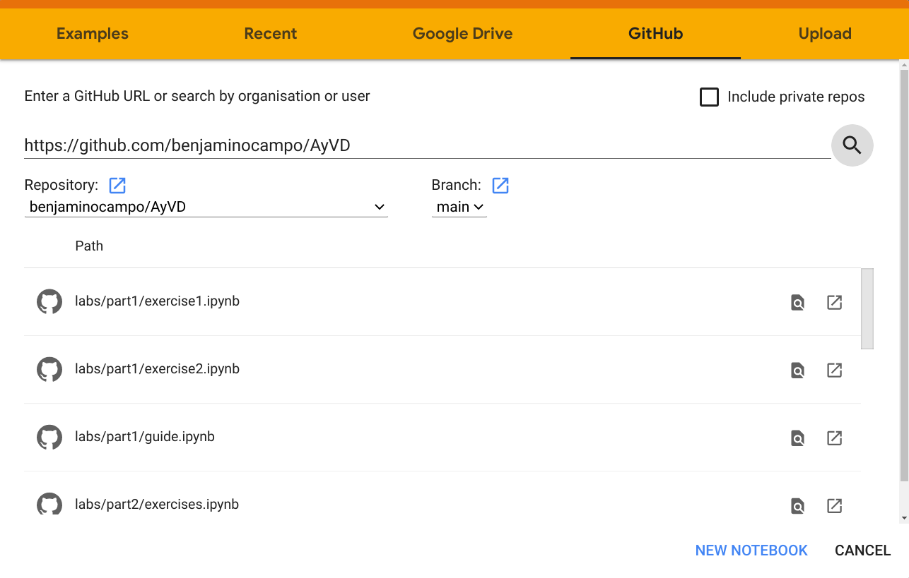

# How to Update Notebooks in This Repository

This documentation describe two different ways to start working remotely.

## Google Colab + GitHub

This method doesn't require any other package or program installed in your computer than just you're favourite browser.

1. First open Google Colaboratory through this link https://colab.research.google.com/ . You'll see that it opens the
following window.


2. Click on the GitHub tab and paste the url of this repository https://github.com/benjaminocampo/DiploDatos on the text blank it shows.
Then click on the search button to check which notebooks are saved in this repository.


3. You'll see a list of all the notebooks that are in the repository. Click on the one you want to update.



4. Then you can start working with the notebook!


5. In order to save notebooks to this repository, choose **File -> Save a copy to GitHub**.


6. Google Colab will ask for GitHub permissions so we just click on **Authorize googlecolab**.


7. Then we add a commit message for our changes. In this case is "Google Colab + GitHub tutorial."
(Tip: Try to write a message that tells the group what you've changed in the notebook).


8. Finally, you'll see these changes in the repository.


	


# How to run the directories for each subject

First you need to get installed `conda` which is a python package manager, and `jupyter lab`. For an step
by step guide see the inscructions in the conda user guide.

After having installed `conda` create a virtual environment for the subject
you are working on. For example, if you want to run the notebooks on the directory AyVD:

1. Create the environment from the environment.yml file:

```
$ conda diploDatos-ayvd create -f environment.yml
```

2. Activate the environment for having available the packages included in `environment.yml`

```
$ conda activate diplodatos-ayvd
```

3. Run jupyter lab in the main directory

```
$ jupyter lab
```

4. Open the jupyter notebook you're interesed in analyzing inside the subject directory.
